# Hastane Yönetim Sistemi


Bu proje, Flask ve SQLAlchemy kullanılarak geliştirilmiş, modern ve kullanıcı dostu bir hastane randevu ve yönetim sistemidir. Sistem; hasta, doktor ve sekreter olmak üzere üç farklı kullanıcı rolünü destekler ve her rol için özelleştirilmiş paneller sunar.

---

## 📖 İçindekiler

- 🚀 Proje Hakkında
- ✨ Temel Özellikler
  - Hasta Rolü
  - Doktor Rolü
  - Sekreter Rolü
- 📸 Ekran Görüntüleri
- 🛠️ Kullanılan Teknolojiler
- ⚙️ Kurulum ve Başlatma
- 🔑 Varsayılan Kullanıcı Bilgileri
- 📂 Proje Yapısı

---

## 🚀 Proje Hakkında

Hastane Yönetim Sistemi, randevu alma süreçlerini dijitalleştirerek hem hastalar hem de hastane personeli için verimliliği artırmayı hedefler. Hastalar online olarak kolayca randevu alabilirken, doktorlar kendi takvimlerini yönetebilir ve sekreterler ise tüm sistemin idari kontrolünü sağlayabilir.

---

## ✨ Temel Özellikler

### Hasta Rolü

- **Kayıt Olma:** Yeni hastalar sisteme kolayca kayıt olabilir.
- **Profil Yönetimi:** Kişisel bilgileri ve şifreyi güncelleme.
- **Randevu Alma:** Branş ve doktora göre uygun tarih ve saatleri listeleyerek randevu oluşturma.
- **Randevu Yönetimi:** Gelecek ve geçmiş randevuları görüntüleme.
- **Randevu İptali:** Gelecek randevuları iptal etme.
- **Detay Görüntüleme:** Randevu detaylarını ve doktorun eklediği notları görme.

### Doktor Rolü

- **Doktor Paneli:** Yaklaşan randevuları ve genel duyuruları listeleme.
- **Randevu Yönetimi:** Randevuları "Tamamlandı" olarak işaretleme.
- **Not Ekleme:** Muayene sonrası randevulara not ekleme.
- **Hasta Geçmişi:** Hastaların geçmiş randevu ve şikayet bilgilerini görüntüleme.

### Sekreter Rolü

- **Yönetim Paneli:** Sistemle ilgili genel istatistikleri (toplam hasta, doktor, bekleyen randevu sayısı vb.) görme.
- **Kapsamlı Randevu Yönetimi:** Tüm randevuları listeleme, filtreleme (hasta, doktor, tarih, durum bazında), düzenleme ve silme.
- **Yeni Randevu Oluşturma:** Hastalar adına randevu oluşturma.
- **Doktor Yönetimi:** Sisteme yeni doktor ekleme.
- **Branş Yönetimi:** Yeni poliklinik/branş tanımlama.
- **Duyuru Yönetimi:** Doktor ve diğer personelin görebileceği duyurular oluşturma.

---

## 📸 Ekran Görüntüleri

Aşağıda sistemin temel sayfalarından bazı ekran görüntüleri yer almaktadır.

#### Hasta Ekranları
| Hasta Girişi | Yeni Kayıt |
| :---: | :---: |
| 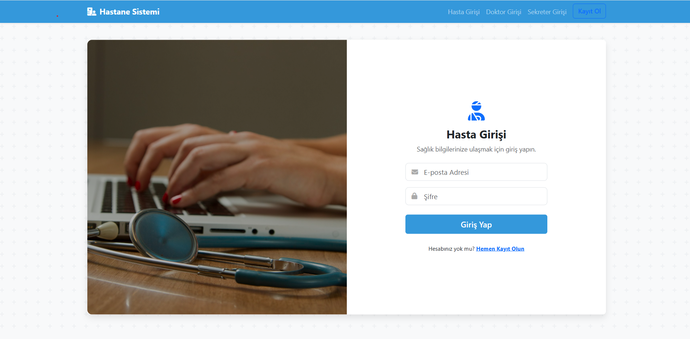 | 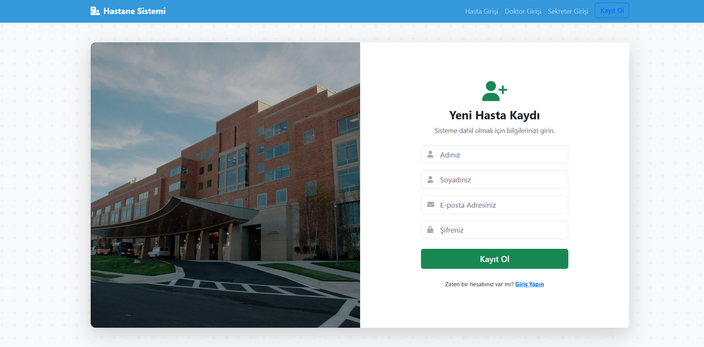 |
| **Randevu Alma** | **Randevu Detayı** |
| 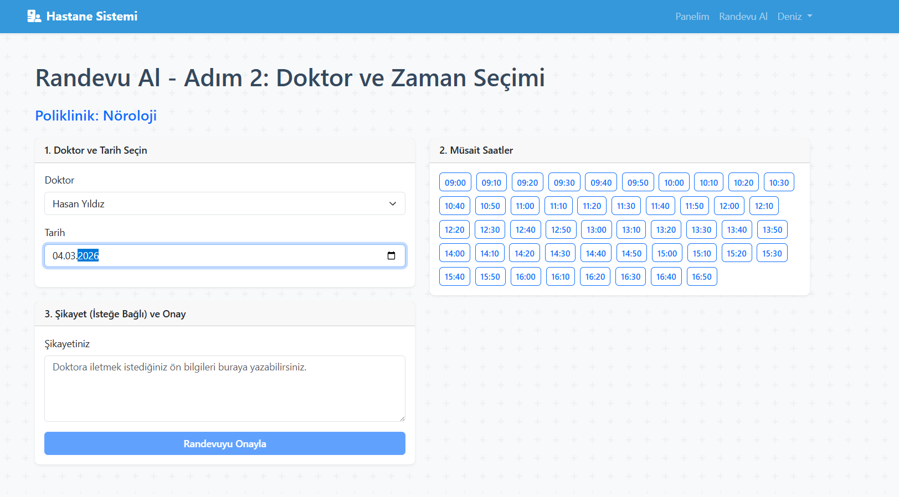 | 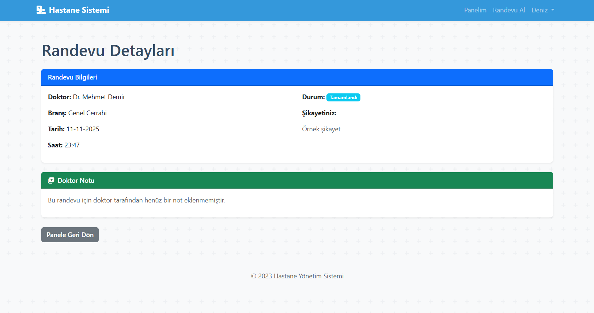 |

#### Doktor Ekranları
| Doktor Girişi | Doktor Paneli |
| :---: | :---: |
| 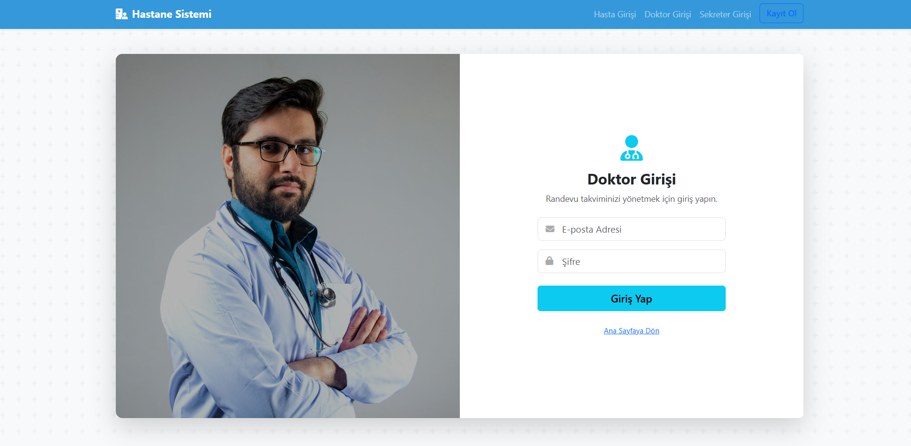 | 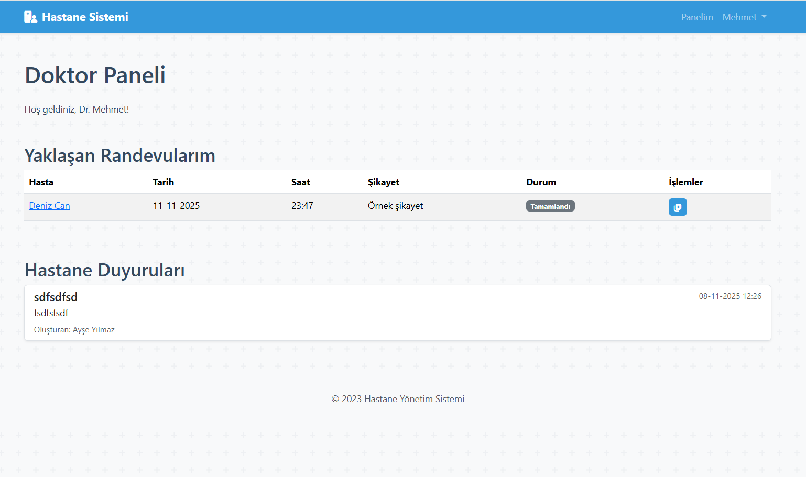 |

#### Sekreter Ekranları
| Sekreter Girişi | Sekreter Paneli |
| :---: | :---: |
| 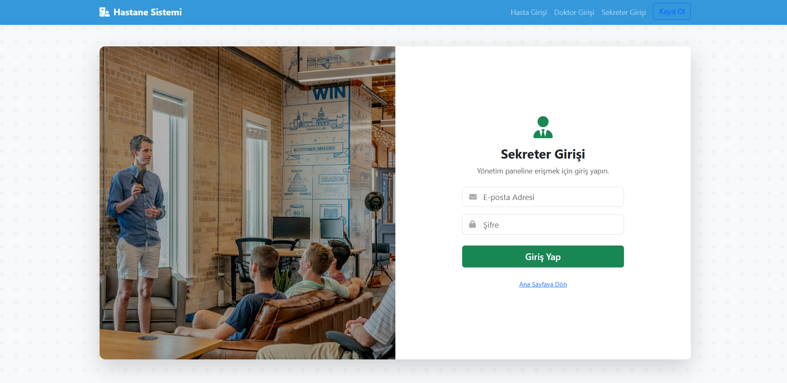 | 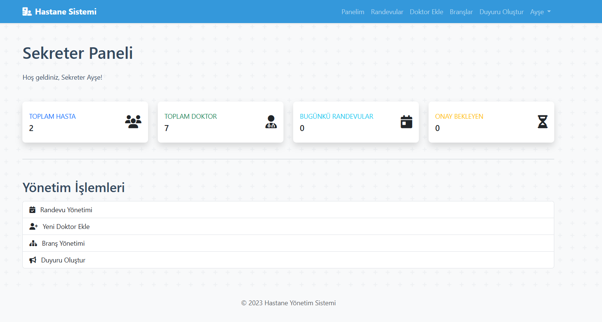 |
| **Randevu Yönetimi** | **Doktor Ekleme** |
| 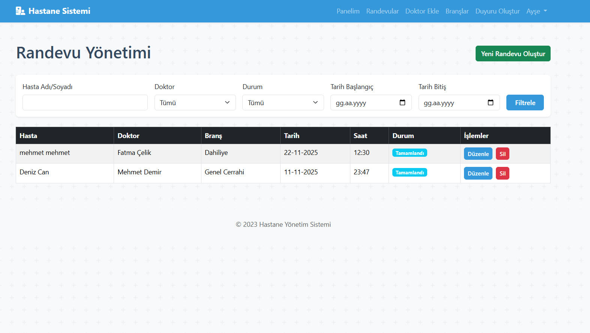 | 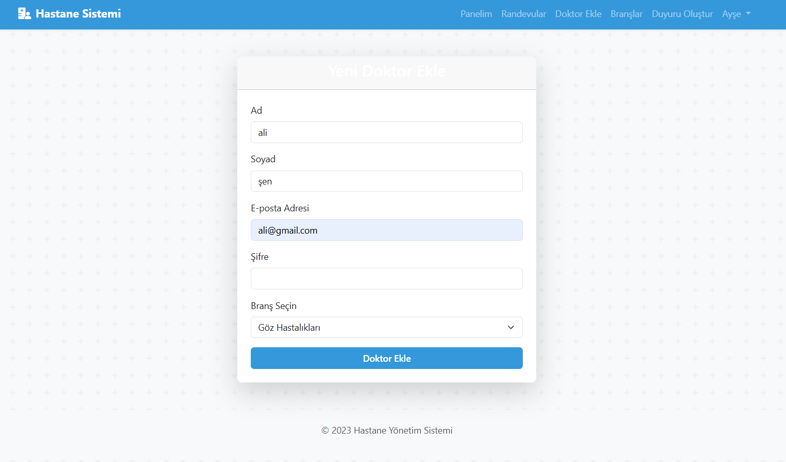 |
| **Branş Yönetimi** |
| 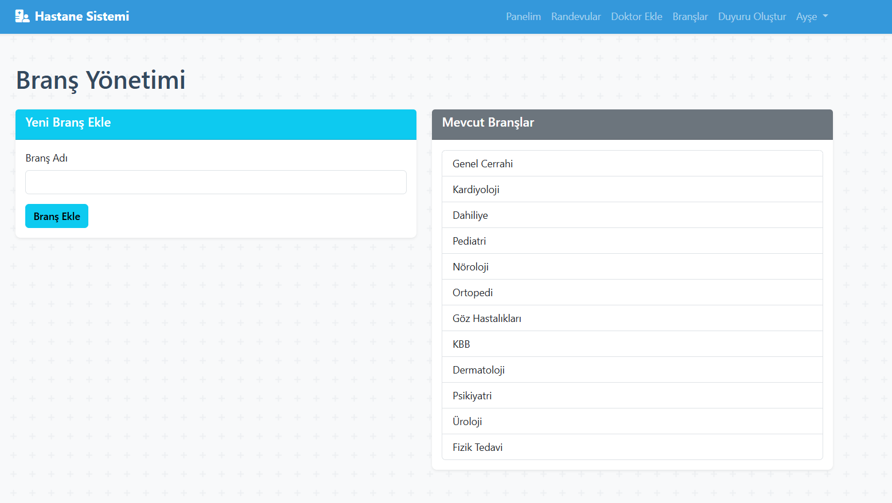 |

---

## 🛠️ Kullanılan Teknolojiler

- **Backend:**
  - 
  - 
  - 
  -  (Şifreleme için)
- **Veritabanı:**
  - 
- **Frontend:**
  - 
  - 
  - 
  - 

---

## ⚙️ Kurulum ve Başlatma

Projeyi yerel makinenizde çalıştırmak için aşağıdaki adımları izleyin.

1.  **Projeyi Klonlayın:**
    ```bash
    git clone https://github.com/furkannaydn/hospital_system.git
    cd hospital_system
    ```

2.  **Sanal Ortam Oluşturun ve Aktif Edin (Önerilir):**
    ```bash
    # Windows
    python -m venv venv
    venv\Scripts\activate

    # macOS / Linux
    python3 -m venv venv
    source venv/bin/activate
    ```

3.  **Gerekli Kütüphaneleri Yükleyin:**
    *Projenizde bir `requirements.txt` dosyası oluşturup bağımlılıkları oraya eklemeniz en iyi pratiktir. Eğer yoksa, aşağıdaki komutlarla manuel olarak yükleyebilirsiniz.*
    ```bash
    pip install Flask Flask-SQLAlchemy
    ```

4.  **Uygulamayı Başlatın:**
    ```bash
    cd hastane_projesi
    python app.py
    ```

5.  **Tarayıcıda Açın:**
    Uygulama başlatıldığında terminalde belirtilen adrese gidin (genellikle `http://127.0.0.1:5000`).

    > **Not:** Uygulama ilk kez başlatıldığında `hastane.db` veritabanı dosyası otomatik olarak oluşturulacak ve varsayılan branş, sekreter, hasta ve doktor verileri eklenecektir.

---

## 🔑 Varsayılan Kullanıcı Bilgileri

Sistemi test etmek için aşağıdaki varsayılan hesapları kullanabilirsiniz:

- **Hasta Hesabı:**
  - **E-posta:** `hasta@hastane.com`
  - **Şifre:** `hasta123`

- **Doktor Hesabı:**
  - **E-posta:** `mehmet.demir@hastane.com` (ve diğerleri)
  - **Şifre:** `doktor123`

- **Sekreter Hesabı:**
  - **E-posta:** `sekreter@hastane.com`
  - **Şifre:** `sekreter123`

---

## 📂 Proje Yapısı

```
hospital_system/
├── hastane_projesi/
│   ├── assets/               # Ekran görüntüleri
│   ├── static/
│   │   └── style.css         # Genel CSS stilleri
│   ├── templates/            # HTML şablonları
│   │   └── ... (tüm .html dosyaları)
│   ├── app.py                # Ana Flask uygulaması
│   └── hastane.db            # SQLite veritabanı dosyası
├── README.md                 # Bu dosya
└── LICENSE                   # Lisans dosyası (varsa)
```